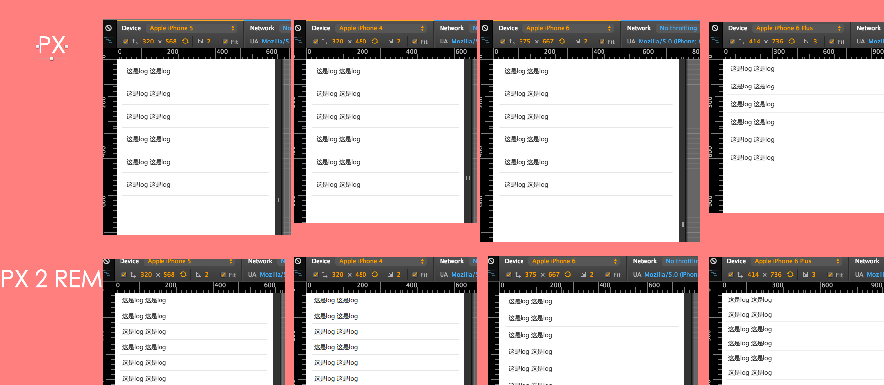
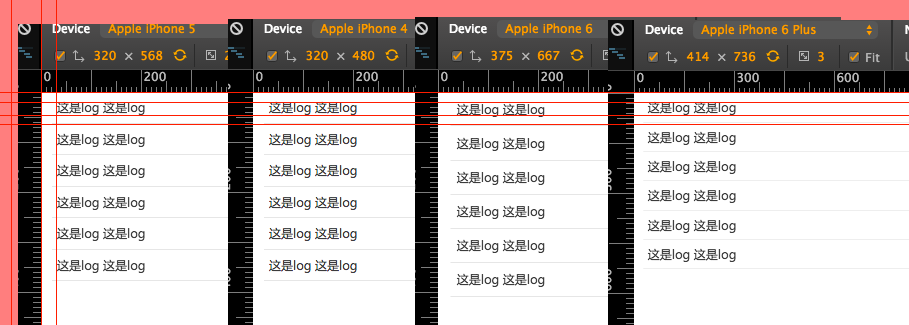
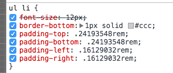

# REM & PX

####布局尺寸使用对比
    
 

#### 文字不同平台下显示问题

文字部分会有一些跟元素布局不一样的问题存在，通常不用rem来设定文字大小。

rem会一直变，而某些情况下 你会希望 iPhone5 iPhone6 上某些段落文字大小一致，所以需要用px来设定。

1. 通过media query来设定某些节点的文字大小。

1. 部分场景下（标题） 希望跟随屏幕宽增大而增大，可以使用rem来作为单位。

一些文字解决方案：

> 由于DPR的原因，24px 在 DPR为2、DPR为3的屏幕上显示是不一样的。
> 
> 所以我们做一个media query 很多不同DPR设定大小，一般这样能解决 设计师要求任何屏幕上字体大小都要统一，这个要求。

 

####这是图片放大至200% 所显示的细节差距

 
 
####原因是：
 
  

